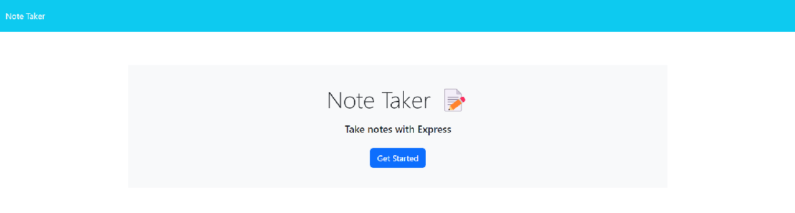
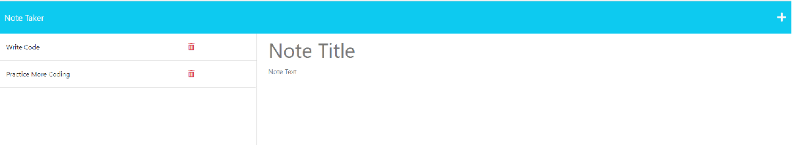
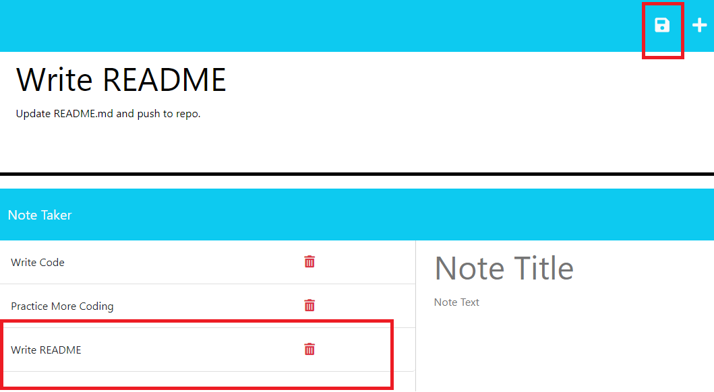
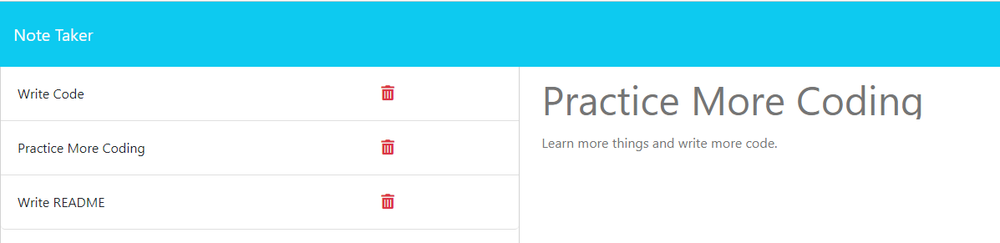
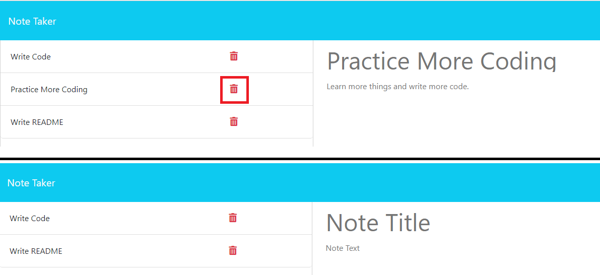

# Note Taker

## Description
The motivation to create this project was to further explore the Express Node.js framework and add a server back-end to a given front-end note taking application. Using Express, I developed a server back-end to a note taking front-end application that lets users write and save notes so that they can organize their thoughts and keep track of tasks that they need to complete. By completing this project, I learned how to develop routes using Express that a client-side user can use to interact with the server-side code via their web browser.

## Table of Contents

- [Installation](#installation)
- [Usage](#usage)
- [License](#license)
- [Contributing](contributing)
- [Tests](#tests)
- [Questions](#questions)

## Installation

Run 'npm i' in the project root directory to install node modules

## Usage

On the homepage of the deployed application, the user is presented with a landing page that contains a nav bar and 'Get Started' button. The nav bar link 'Note Taker' brings the user back to the landing page, which can be used from any page of the site. By clicking the 'Get Started' button, the user is brought to the '/notes/' endpoint, which they can use to take their notes.

The '/notes' endpoint contains the nav bar and two columns. The left column displays any existing notes (which are stored on the server) and the right column presents the user with an area that can be used to write a new note. By default, the nav bar displays a "write" button in the upper-right-hand corner that will clear the note taking area.

Once the 'Note Title' and 'Note Text' fields are populated with text, a save icon is revealed that will save the title and text to the server and clear the input areas in the right column. The left column will also rerender and contain the newly saved note.

By clicking on an existing note in the left column, the page will rerender the right column to contain the selected note's title and text.

In the left column, each existing note contains a delete button represented by a garbage bin icon. Clicking on the icon will delete the note from the server and rerender the page with the note deleted.

To begin a new note, the user can click on the '+' icon in the upper-right hand corner to clear the Note Title and Note Text fields and begin a fresh thought!

## License

N/A

## Contributing

N/A

## Tests

N/A

## Questions

You can find the deployed application [on Heroku](https://note-taker-ryanafernandez.herokuapp.com).

If you have any questions about the repo, open an issue or contact me directly at ryanfernandez11@gmail.com. You can find more of my work at [my GitHub page](https://github.com/ryanafernandez/).